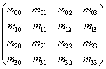
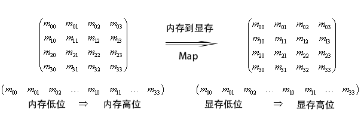
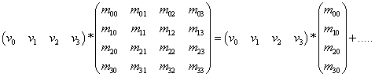
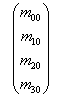
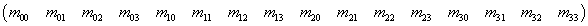
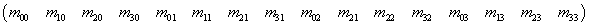

# 行列存储 

## 行/列存储定义 
一个Matrix有4X4个float,取一个简单的例子，拿2X2的矩阵来说，
 
	M00 M01
	M10 M11 
如果是行存储，在内存地址中，从低到高为M00,M01, M10,M11 
如果是列存储，在内存地址中，从低到高为M01,M10, M01,M11

## 行/列向量乘法 
1. 行向量乘法： 向量在左，矩阵在右， 
2. 列向量乘法： 向量在右，矩阵在左

## 列存储，行向量乘法 比 行存储行向量乘法要快
按着矩阵乘法的定义，列存储行向量速度肯定快，因为对于向量矩阵乘法来说， 
 
	(a,b) X M00 M01   
            M10 M11  
其中 a,b内存连续，因为是列存储,矩阵表示为{M00,M10,M01,M11}, 其中M00,M10内存连续，这样读取速度比较快，可以直接将这段内存(缓存）填到寄存器中； 
如果是行存储，行向量，则 M00,M10中间还隔了一个M01，需要跳过一个float来组装成向量填到寄存器；

## 同理， 行存储，列向量的乘法比行存储行向量的乘法要快 

## HLSL是列/行存储？
主要看HLSL在编译的时候使用的是D3D10_SHADER_PACK_MATRIX_ROW_MAJOR 还是D3D10_SHADER_PACK_MATRIX_COLUMN_MAJOR.
如果是Row Major的话，就是行存储，如果是Column Major的话是列存储

### constant buffer是行存还是列存？
跟HLSL编译期的Row Major 还是Colum Major没关系，Map时，内存传给GPU的是什么就是什么，因为CPU端通常是行存储，所以一个
 
的矩阵，在CPU端内存的布局是从低到高为M00,M01,M02,M03,M10 ... 这样子存的。 

### RowMajor和ColumnMajor影响了什么
影响了Shader中 矩阵的内存布局。 
以上述为例： 
 
左边是内存，右边是显存中的cbuffer,也就是说在数据从内存拷贝到显存的过程中，跟shader编译是否设row major还是column major没有关系。

但是进入shader后，比如在vs里，这里使用列存储
**第一列**对应的值是`{m00,m01,m02,m03}`
第二列对应的值是`{m10,m11,m12,m13}`
如果使用的是行存储，
第一行对应的值是`{m00,m01,m02,m03}`
第二行对应的值是`{m10,m11,m12,m13}`

### 列存储行向量 向量矩阵乘法
对于

	float4 FinalPos = mul(Input.Pos, WVP) 

其对应的汇编代码为 

	0： dp4 r2.x, r1.xyzw, cb0[8].xyzw  // r2.x <- Output.vPosition.x
	1： dp4 r2.y, r1.xyzw, cb0[9].xyzw  // r2.y <- Output.vPosition.y
	2： dp4 r2.z, r1.xyzw, cb0[10].xyzw  // r2.z <- Output.vPosition.z
	3： dp4 r2.w, r1.xyzw, cb0[11].xyzw  // r2.w <- Output.vPosition.w

可见在shader要实现 
 
其中第一列
  
对应的显存是`{m00，m10,m20,m30}`，因为是列存储。
这样，对于在cpu端的向量矩阵乘法，放到gpu中列存储时，矩阵内存布局如下
对于cpu来说：

对于gpu来说：  

所以**当从cpu往gpu传矩阵**时，使用**列存储**时，需要将原矩阵**转置** ，如果使用行存储，则不需要转置，但速度较慢

### 列存储行向量 vs 行存储行向量  
1. 在矩阵与矩阵相乘时，速度是一样的
2. 在向量与矩阵乘时，因为行存储需要跨连续内存来对齐数据，比较慢，见汇编 
	
   		0: mul r0.xyzw, v0.xxxx, cb0[8].xyzw
   		1: mul r1.xyzw, v0.yyyy, cb0[9].xyzw
   		2: add r0.xyzw, r0.xyzw, r1.xyzw
   		3: mul r1.xyzw, v0.zzzz, cb0[10].xyzw
   		4: add r0.xyzw, r0.xyzw, r1.xyzw
   		5: mul r1.xyzw, v0.wwww, cb0[11].xyzw
   		6: add r0.xyzw, r0.xyzw, r1.xyzw  // r0.x <- Output.vPosition.x; r0.y <- Output.vPosition.y; r0.z <- Output.vPosition.z; r0.w <- Output.vPosition.w
可以见到用了7条指令（4个乘法，3个加法），而列存储只用了4个dp4的指令
3. 如果从一个matrix中，取出对应的行向量，使用列存储比较慢，原因如上：` matrix g_VP; float4 row0 = g_VP[0] `
**注意**：matrix[]操作符号只取第一行，不管是列存储还是行存储

# 说白了，列存储就是在矩阵取一列时，获取的是内存连续的一个float4