#FbxAnimation
[fbxdocumnt](http://help.autodesk.com/view/FBX/2018/ENU/?guid=__files_GUID_10CDD63C_79C1_4F2D_BB28_AD2BE65A02ED_htm) 

# 注意
Fbx的变换矩阵主要是为Maya来设计的，在3dsmax的导入导出插件中，把3ds max的各种变换矩阵转成Maya的。 
> The FBX SDK and Maya use the same formula to compute a transformation matrix. However, 3ds Max uses a different formula.
__NOTE__:The FBX importers and exporters for 3ds Max automatically convert transformation matrices to and from 3ds Max.

# 矩阵变换FBX与Maya
`WorldTransform = ParentWorldTransform * T * Roff * Rp * Rpre * R * Rpost -1 * Rp -1 * Soff * Sp * S * Sp -1` 
`V' = WorldTransform * V`

| Term	        | 4 x 4 matrix      | 
| ------------- |:-----|
| WorldTransform| Transformation matrix of the node | 
| ParentWorldTransform| Transformation matrix of the node |
| T| Translation |
|Roff| Rotation offset |
| Rp| Rotation pivot |
| Rpre| Pre-rotation |
| R| Rotation |
| Rpost -1| Inverse of the post-rotation |
| Rp -1| Inverse of the rotation pivot |
| Soff| Scaling offset |
| Sp| Scaling pivot |
| S| Scaling |
| Sp -1| Inverse of the scaling pivot | 

1. __NOTE__:The effect of the formula is that any given vector is first scaled, then rotated, and finally translated.也就是说是先scale,再rotate,最后translate
2. The R matrix takes into account the rotation order. Because of the mathematical properties of the matrices, R is the result of one of the possible combinations of Rx, Ry, and Rz (each being matrices). For example, for the default rotation order of XYZ, R = Rz * Ry * Rx.也就是说默认的欧拉角是XYZ轴序的内旋。

# 矩阵变换3ds max
`WorldTransform = ParentWorldTransform * T * R * S * OT * OR * OS` 

| Term	        | 4 x 4 matrix      | 
| ------------- |:-----|
| WorldTransform| Transformation matrix of the node | 
| ParentWorldTransform| Transformation matrix of the node |
| T| Translation |
| R| Rotation |
| S| Scaling |
| OT| Geometric transform translation | 
| OR| Geometric transform rotation | 
| OS| Geometric transform scaling | 

1. >Geometric translation, geometric rotation, and geometric scaling relate to the object-offset concept in 3ds Max. These geometric transformations are applied to the node attribute after the node transformations.
2. >Geometric transformations are not inherited: ParentWorldTransform does not contain the OT, OR, and OS of WorldTransform’s parent node. 这点很重要，不向下传递
3. >Geometric transformations are implemented in the FBX SDK as three properties of the FbxNode object: FbxNode::GeometricTranslation, FbxNode::GeometricRotation, and FbxNode::GeometricScaling.

# 动画的实现
1. 每个FbxNode的节点的rotation,scaling,traslation都有一个FbxProperty<double3>，每个通道是是一个curve.
2. FbxProperty<double3>存在于FbxAnimCurveNode中
3. FbxAnimCurveNode存在于FbxAnimLayer中
4. FbxAnimLayer存在于FbxAnimStack中，FbxAnimStack中存在多个FbxAnimLayer，用来做不同Layer间的混合使用。

## FbxNode中关于变换的变量
1. FbxPropertyT<FbxDouble3> LclTranslation
	>This property contains the translation information of the node,Default value is 0.,0.,0.
2. FbxPropertyT<FbxDouble3> LclRotation
	>This property contains the rotation information of the node,Default value is 0.,0.,0.
3. FbxPropertyT<FbxDouble3> LclScaling
	>This property contains the scaling information of the node,Default value is 1.,1.,1.
4. FbxPropertyT<FbxDouble> Visibility
	>This property contains the visibility information of the node,0 means invisible, and anything else means visible
5. FbxPropertyT<FbxDouble3> RotationOffset
	>This property contains the rotation offset information of the node,Default value is 0.,0.,0.
6. FbxPropertyT<FbxDouble3> RotationPivot
	>This property contains the rotation pivot information of the node,Default value is 0.,0.,0.
7. FbxPropertyT<FbxDouble3> ScalingOffset 
	>This property contains the scaling offset information of the node,Default value is 0.,0.,0.
8. FbxPropertyT<FbxDouble3> ScalingPivot
	>This property contains the scaling pivot information of the node,Default value is 0.,0.,0.
9. FbxPropertyT<EFbxRotationOrder> RotationOrder
	>This property contains the rotation order information of the node,Default value is eEulerXYZ.(inner rotate)
10. FbxPropertyT<FbxDouble3> PreRotation
	>This property contains pre-rotation information of the node,Default value is 0.,0.,0
11. FbxPropertyT<FbxDouble3> PostRotation
	>This property contains post-rotation information of the node ,Default value is 0.,0.,0
12. FbxPropertyT<FbxTransform::EInheritType> InheritType 
	>This property contains inherit type information of the node, Default value is eInheritRrSs. 
13. FbxPropertyT<FbxDouble3> GeometricTranslation 
	>This property contains geometric translation information of the node  
14. FbxPropertyT<FbxDouble3> GeometricRotation
	>This property contains geometric rotation information of the node
15. FbxPropertyT<FbxDouble3> GeometricScaling
	> This property contains geometric scaling information of the node,Default value is 1.,1.,1. 

## FbxPropertyFlags::EFlags中决定上述的变换变量是否可以带动画曲线 
 
	enum EFlags
	{
		eNone = 0,					//!< No flag.
		eStatic = 1 << 0,			//!< Property is defined in the class declaration, so it wasn't created dynamically.
		eAnimatable = 1 << 1,		//!< Property can be animated, thus is can have am animation curve node connected.带动画，得手动创建，pCube->GeometricTranslation.GetCurveNode(pAnimLayer, true);
		eAnimated = 1 << 2,			//!< Property is animated, so it also has an animation curve node connected.带动画的，不用手动创建，pCube->LclRotation.GetCurveNode(pAnimLayer, false);
	}

GeometricTranslation's Property is eStatic
GeometricRotation's Property is eStatic
GeometricScaling's Property is eStatic
RotationOffset's Property is eStatic
RotationPivot's Property is eStatic
ScalingOffset's Property is eStatic
ScalingPivot's Property is eStatic
RotationOrder's Property is eStatic
PreRotation's Property is eStatic
PostRotation's Property is eStatic
LclScaling's Property is eStatic __eAnimatable__ :得手动创建
LclRotation's Property is eStatic eAnimatable __eAnimated__：不用手动创建，自带曲线
LclTranslation's Property is eStatic __eAnimatable__：得手动创建
Visibility's Property is eStatic __eAnimatable__：得手动创建

## 导出时上述参数对导出几何参数的影响
模型为（70，30，50）的盒子，opengl
###  LclScaling
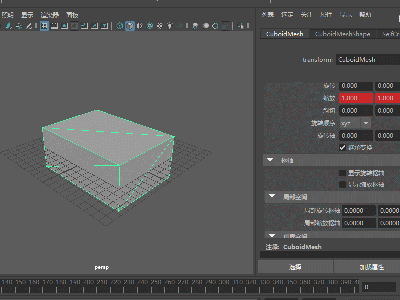
__注意__:ScalingOffset,Scaling Pivot都是默认
###  LclScaling & ScalingPivot
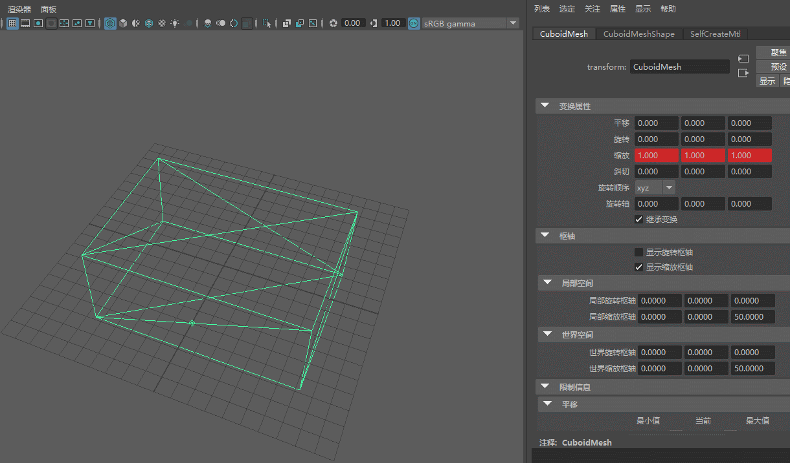
__注意__:SCalingPivot为（0，0，50）
###  LclScaling & ScalingPivot &　ScalingOffset 

__注意__:SCalingPivot为（0，0，50）,ScalingOffset(0,0,-210)
###　LclRotation

### LclRotation & RotationPivot
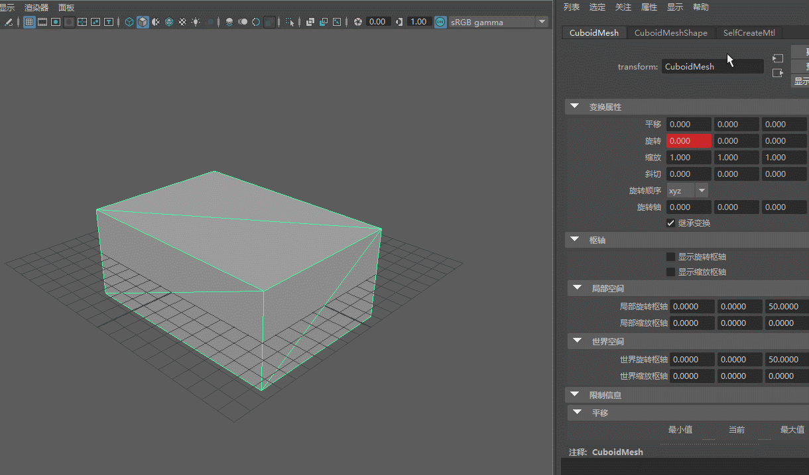
 __注意__:RotationPivot(0,0,50)
 __注意__: 由于Max不支持Rotation Pivot，旋转的时候只能在物体的Piovt旋转（默认是中心），所以要调整物体的位置来实现效果一致。曲线如图下所示：
 Maya: 

 Max:
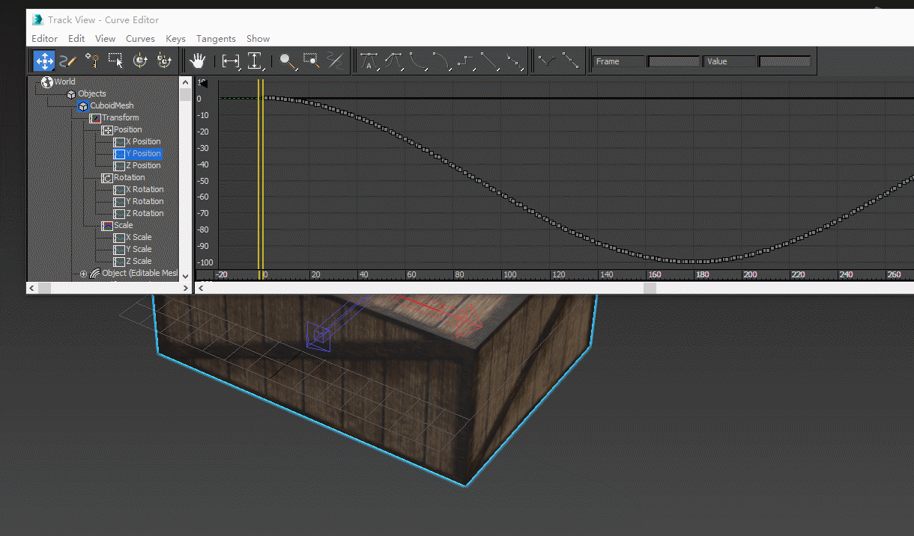
### LclRotation & RotationPivot & RotationOffset
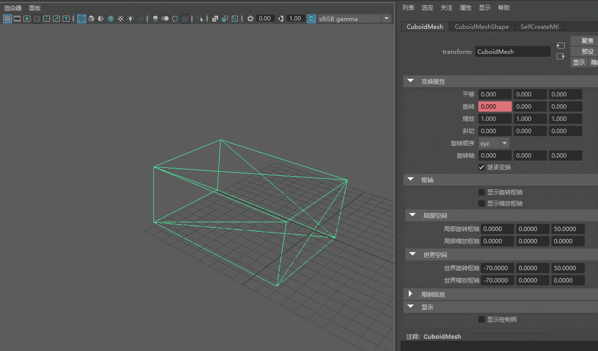
 __注意__:RotationPivot(0,0,50),RotationOffset(-70,0,0)
### LclRotation & PostRotation
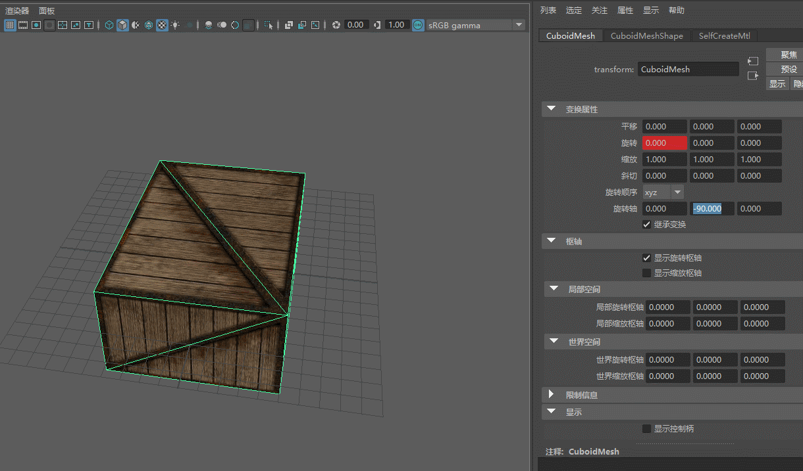
 __注意__:使用Post/PreRoate时，要把RotateActive置为true，默认RotateActive为false，将不计算PostRotate和PreRotate.
`GetNode()->SetRotationActive(true);`
 __注意__:RotationPivot(0,0,50),PostRotation(0,90,0),因为矩阵计算时，使用了PostRotate的逆，故在Maya中显示的是**-90**
 __注意__:PostRotation的逆对应maya中的“变换属性”-》“旋转轴”

### LclRotation & PreRotation 
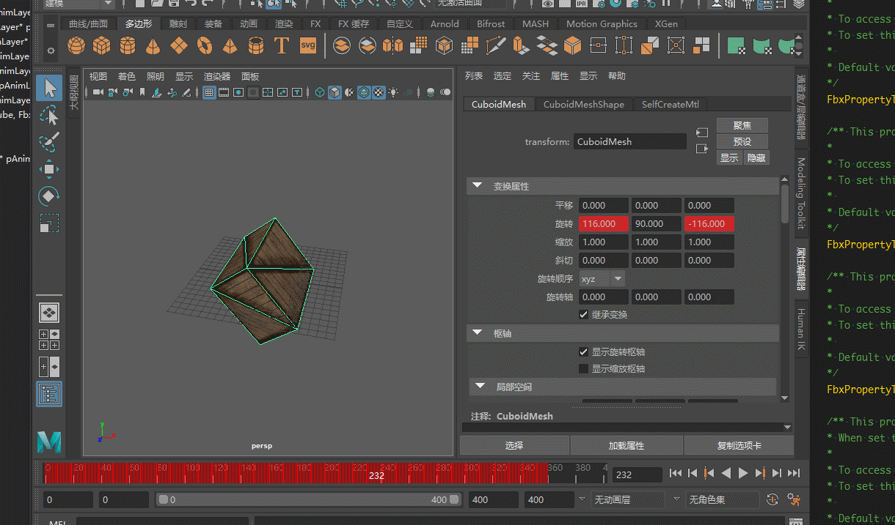
 __注意__:使用Post/PreRoate时，要把RotateActive置为true，默认RotateActive为false，将不计算PostRotate和PreRotate.
`GetNode()->SetRotationActive(true);`
 __注意__:RotationPivot(0,0,50),PreRotation(0,90,0),因为Maya没有PreRotate对应的变换参数，所以要重计算，在动画轴上可以看到有连续的key帧。
### LclTranslate
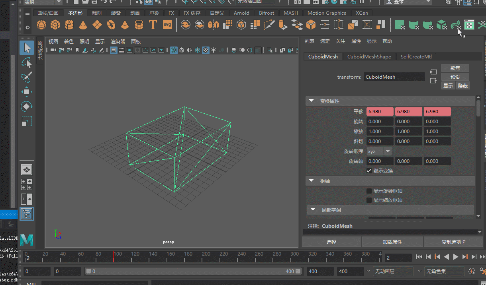

### GeometryRotate
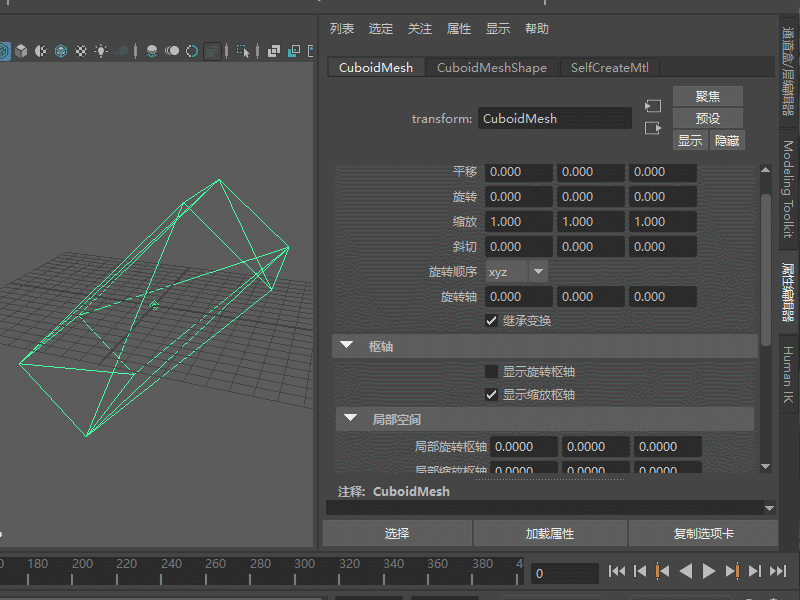
__注意__: 旋转为（0，0，50）,可见maya处理不了GeometryRotate时，直接变换了ControlPoint的位置。 Max和Maya的处理方法一致。 

### GeoMetryTranslate
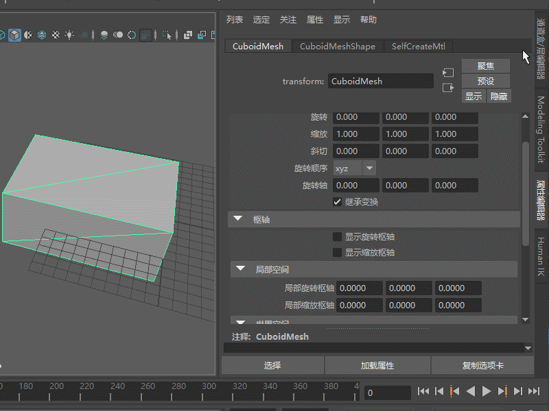
__注意__: 偏移为（0，0，-70）,可见maya处理不了GeometryTranslate时，直接变换了ControlPoint的位置。 Max和Maya的处理方法一致。 

### GeoMetryScaling
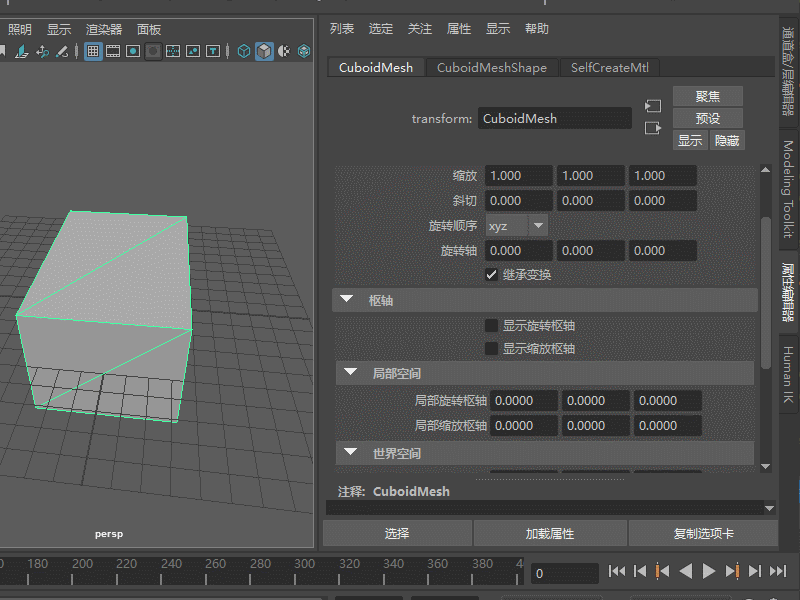
__注意__: 缩放为（0.5，1,1）,可见maya处理不了GeometryTranslate时，直接变换了ControlPoint的位置。 Max和Maya的处理方法一致。 

# Convert
FbxNode中包含两个PivotSet
1. FbxNode::eSourcePivot
2. FbxNode::eDestinationPivot
节点的动画可以在两个PivotSet间转化。
Pivot集中保存有
Rotation offset (Roff)
Rotation pivot (Rp)
Pre-rotation (Rpre)
Post-rotation (Rpost)
Scaling offset (Soff)
Scaling pivot (Sp)
Geometric translation (Gt)
Geometric rotation (Gr)
Geometric scaling (Gs)

## Convert使用场景
比如从Maya中导出的带RotatePivot的动画，因为max中没有处理RotatePivot的能力，故将带RotatePivot的动画转化为用SRT的矩阵来表示，Convert就是干这个事的。
### 使用方法
下面示例：将带PivotRotate的eSourcePivot转化为不带PivotRotate的eDestinationPiovt
1. 设置好动画；
		// Enable pivot
		pCubeNode->SetRotationActive(true);
		// Set the rotation pivot at the center of the pyramid
		pCubeNode->SetRotationPivot(FbxNode::eSourcePivot, FbxVector4(0, 2, 0));
2. 将PivotState设为active,
		pCubeNode->SetPivotState(FbxNode::eSourcePivot, FbxNode::ePivotActive);
		pCubeNode->SetPivotState(FbxNode::eDestinationPivot, FbxNode::ePivotActive);
3. 将eDestinationPivot的RotatePivot设置为0
		pCubeNode->SetRotationPivot(FbxNode::eDestinationPivot, FbxVector4(0, 0, 0));
4. 转化
		pScene->GetRootNode()->ConvertPivotAnimationRecursive(lAnimStack, FbxNode::eDestinationPivot, 30.0);
5. __注意__:
	1. 只在eSourcePivot集的变换信息才被maya,max等读取并渲染；
	2. 变换完后，RotationActive为false
