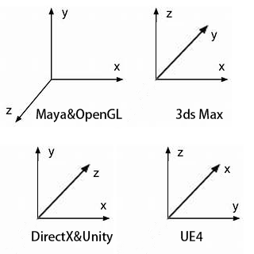

# UE convert FBX
1. /source/Editor/UnrealEd/Fbx 下

## 坐标系

## importer

	FFbxImporter::GetImportType   //第一遍解析场景，
		|- FFbxImporter::OpenFile // 创建FbxImpoter
		|- FFbxImporter::GetSceneInfo 
			|- FFbxImporter::ImportFile 
				|- 创建FbxScene,import scene
				|- FixMaterialClashName() //重复的材质名后面加上_后缀  		
			|- 解析FbxScene 填入 FbxSceneInfo（材质数量，纹理数量，图元数量，Skin数量）
			|- FbxScene::GetGeometryCount()来获取图元数量，遍历场景中的图元
				|- 如果图元的属性是Mesh
					|- 通过Mesh->GetDeformerCount(FbxDeformer::eSkin)来判断是不是Skin
						|- 如果是SKin判断Lod
						|- 填充FbxMeshInfo(名子，是否三角化，材质数量，面数，顶点数,LOD,LOD级别，是否是SkinMesh,根骨骼名子，骨骼数量，Morph数量)，并存入FbxSceneInfo
			|- 判断场景中是否有动画（3ds max导出后有translation/rotation两个固定的动画曲线，要从第三条曲线开始判断有没有动画）
			|- 获取场景帧率
			|- 获取场景动画时间
			|- 获取节点间的变换关系
				|- 获取RootNode的变换信息(节点名，UniuqeID, Transform)并填入FbxNodeInfo,并将FbxNodeInfo节点放入FbxSceneInfo::HierachyInfo.
				|- 深度优先遍历整个Scene，将节点信息存入FbxSceneInfo::HierachyInfo.