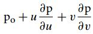
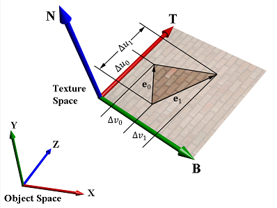
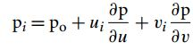
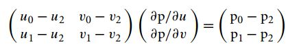
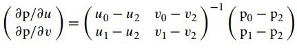

# TangentSpace
TangentSpace用来解决三角形平面到纹理平面的映射关系的空间。
NormalMap就是将encoding在纹理中的数据decoding出来的过程，如果要保证正确的话，需要保证encoding的context与decoding的context一致。 这个Context就是指在Raytrace从高模到低模时，获取到的法线方向，但是这个法线方向是定义在TangentSpace中，所以要在渲染前计算出来TangentSpace来保证还原出来与烘焙法线时的Tangent空间一致。

>A common **misunderstanding** about tangent space normal maps is that this representation is
somehow asset independent. However, normals sampled/captured from a high resolution
surface and then transformed into tangent space is more like an encoding. Thus to reverse
the original captured field of normals the transformation used to decode would have to be
the exact inverse of that which was used to encode.

# TangentSpace的数学推导
> cite form pbrt

跟据曲面参数化三角形， 
 
Po为三角形平面上的一点，∂p/∂u，∂p/∂v 分别是平面上的一点对u,v的偏导，说白了就是以∂p/∂u，∂p/∂v为基，定义三角形，如下图 
 ,
可得 
 
其中Pi是指三角形的一定顶点。由P1-P0,P2-P1联立，可得方程 
 
解方程 
 

其中∂p/∂u就是Tangent基，∂p/∂v是Bitangent的基。 注意：两者极有可能不正交。

# UE中计算方法
见Developer/MeshUtilities/MeshUtilities.cpp中的Skeletal_computeTriangleTangents. 其中UE为了使用4x4的矩阵计算方便，将2X2的uv矩阵转为了4X4的矩阵，2X3的位置矩阵转了了4X4的矩阵，其计算结果一致。 
见 `2X2矩阵算Tangent.nb` 与 `4X4矩阵算Tangent.nb` 文件，需要用Mathematica打开。
