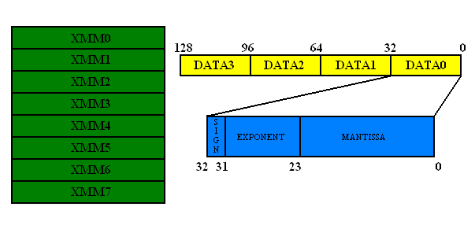

#SIMD
SIMD(Single instruction, multiple data (SIMD))

一般通过嵌入汇编来使用这些指令，即Compiler Instrinsics。Intrinsics是对MMX、SSE等指令集的指令的一种封装，以函数的形式提供，使得程序员更容易编写和使用这些高级指令，在编译的时候，这些函数会被内联为汇编，不会产生函数调用的开销。
##Histroy
1.	第一代MMX,3DNow! ``__m64``,不支持x64
2.	第二代SSE,SSE2,SSX, ``__128``,
3.	第三代AVX指令集

**相关手册见paper**
##SSE指令集
###指令集组成
SSE指令包括了四个主要的部份：单精确度浮点数运算指令、整数运算指令（此为MMX之延伸，并和MMX使用同样的暂存器）、Cache控制指令、和状态控制指令。
###SSE新增的寄存器（用于浮点运算指令）
SSE新增了八 ​​个新的128位元暂存器，xmm0 ~ xmm7。这些128位元的暂存器，可以用来存放四个32位元的单精确度浮点数。SSE的浮点数运算指令就是使用这些暂存器。
下图是SSE新增寄存器的结构：

###SSE浮点运算指令分类
SSE的浮点运算指令分为两大类：packed和scalar

Packed指令是一次对XMM暂存器中的四个浮点数（即DATA0 ~ DATA3）均进行计算，而scalar则只对XMM暂存器中的DATA0进行计算。如下图所示：

###SSE指令一般格式
由三部分组成，第一部分是表示指令的作用，比如加法add等，第二部分是s或者p分别表示scalar或packed，第三部分为s，表示单精度浮点数（single precision floating point data）,d表示双精度，如下图：

###SSE新的数据类型
根据上面知道，SSE新增的寄存器是128bit的，那么SSE就需要使用128bit的数据类型，SSE使用4个浮点数（4*32bit）组合成一个新的数据类型，用于表示128bit类型，SSE指令的返回结果也是128bit的。
1.	__m128
2.	__m128i
3.	__m128d

###SSE定址/寻址方式
SSE 指令和一般的x86 指令很类似，基本上包括两种定址方式：寄存器-寄存器方式(reg-reg)和寄存器-内存方式(reg-mem)：

		addps xmm0, xmm1 ; reg-reg
		addps xmm0, [ebx] ; reg-mem

###SSE指令的内存对齐要求
SSE中大部分指令要求地址是16bytes对齐的，要理解这个问题，以_mm_load_ps函数来解释，这个函数对应于loadps的SSE指令。其原型为：``extern __m128 _mm_load_ps(float const*_A)``,可以看到，它的输入是一个指向float的指针，返回的就是一个``__m128``类型的数据，从函数的角度理解，就是把一个float数组的四个元素依次读取，返回一个组合的``__m128``类型的SSE数据类型，从而可以使用这个返回的结果传递给其它的SSE指令进行运算，比如加法等；从汇编的角度理解，它对应的就是读取内存中连续四个地址的float数据，将其放入SSE新的暂存器(xmm0~8)中，从而给其他的指令准备好数据进行计算。其使用示例如下：

	float input[4] = { 1.0f, 2.0f, 3.0f, 4.0f };  
	__m128 a = _mm_load_ps(input);  

这里加载正确的前提是：input这个浮点数阵列都是**对齐在16 bytes**的边上。否则加载的结果和预期的不一样。如果**没有对齐**，就需要使用``_mm_loadu_ps``函数，这个函数用于处理没有对齐在16bytes上的数据，但是其速度会比较慢。关于内存对齐的问题，这里就不详细讨论什么是内存对齐了，以及如何指定内存对齐方式。这里主要提一下，SSE的intrinsics函数中的扩展的方式：
对于上面的例子，如果要将input指定为16bytes对齐，可以采用的方式是：

		__declspec(align(16)) float input[4];
		那么，为了简化，在xmmintrin.h中定义了一个宏_MM_ALIGN16来表示上面的含义，即：_MM_ALIGN16 float input[4];

###大小端问题
x86的little-endian特性，位址较低的byte会放在暂存器的右边。也就是说，若以上面的input为例，在载入到XMM暂存器后，暂存器中的DATA0会是1.0，而DATA1是2.0，DATA2是3.0，DATA3是4.0。如果需要以相反的顺序载入的话，可以用_mm_loadr_ps 这个intrinsic，根据需要进行选择。

##[指令集操作](https://software.intel.com/sites/landingpage/IntrinsicsGuide/)[msdn](https://msdn.microsoft.com/zh-cn/library/hh977022.aspx)
### Load/Store/Set 
####Load
从内存到寄存器

	__m128 _mm_load_ss (float *p)  //scalar加载 
	__m128 _mm_load_ps (float *p)  // vector加载，16bit内存对齐
	__m128 _mm_loadu_ps (float *p) // vector加载，没必要对齐

####Set

	__m128 _mm_set_ss (float w)  
	__m128 _mm_set_ps (float w, float z, float y, float x)
	__m128 _mm_setr_ps (float x, float y, float z, float w) //不带r的是从高位开始填，是反着的，带r的符合正常习惯 
	__m128 _mm_setzero_ps ()                                //清零
	__m128i _mm_setr_epi32 (int e3, int e2, int e1, int e0) //设整数

####Store
从寄存器到内存

	void _mm_store_ss (float *p, __m128 a)  
	void _mm_store_ps (float *p, __m128 a)  

####加法
	
	__m128 _mm_add_ss (__m128 a, __m128 b)  
	__m128 _mm_add_ps (__m128 a, __m128 b)  
####减法
	__m128 _mm_sub_ps (__m128 a, __m128 b)

####shuffle
	__m128 _mm_shuffle_ps (__m128 a, __m128 b, unsigned int imm8)
	{
		SELECT4(src, control){ //下面会调用，就是根据control（2bit,4种值，对应__m128的每个float)
			CASE(control[1:0])
			0:	tmp[31:0] := src[31:0]
			1:	tmp[31:0] := src[63:32]
			2:	tmp[31:0] := src[95:64]
			3:	tmp[31:0] := src[127:96]
			ESAC
			RETURN tmp[31:0]
		}
		
		dst[31:0] := SELECT4(a[127:0], imm8[1:0]) 
		dst[63:32] := SELECT4(a[127:0], imm8[3:2])
		dst[95:64] := SELECT4(b[127:0], imm8[5:4])
		dst[127:96] := SELECT4(b[127:0], imm8[7:6])
	}
	用于快速的将vector的值全赋为其某一元素，见VectorReplicate
#### and
	__m128 _mm_and_ps (__m128 a, __m128 b)

##DirectXMath
[Introducing DirectXMath](https://blogs.msdn.microsoft.com/chuckw/2012/03/26/introducing-directxmath/) 主要介绍了DirectXMath数学库不再依赖<windows.h>头文件。

[DirectXMath注意事项](https://msdn.microsoft.com/en-us/library/windows/desktop/ee418732(v=vs.85).aspx#Properly_Align_Alloc) 介绍了

1.	SSE指令对内存16bit对齐的速度较快，x64和x86在栈上的变量和和全局变量都是16位对齐的内存分配，但malloc时，对x64来说是16位对齐的，x86来说是8位对齐的，故对于x86使用SSE时，要注意分配器的16位对齐。[内存对齐的stl内存分配器](https://blogs.msdn.microsoft.com/vcblog/2008/08/28/the-mallocator/)
2.	For Windows x86 targets, enable /arch:SSE2. For all Windows targets, enable /fp:fast.

##CODE SNAP
	#include <immintrin.h>
	#include <intrin.h>
	#include <stdio.h>
	#include <stdlib.h>
	#include <string.h>
	
	union Mat44 {
	    float m[4][4];
	    __m128 row[4];
	};
	
	// reference implementation
	void matmult_ref(Mat44 &out, const Mat44 &A, const Mat44 &B)
	{
	    Mat44 t; // write to temp
	    for (int i=0; i < 4; i++)
	        for (int j=0; j < 4; j++)
	            t.m[i][j] = A.m[i][0]*B.m[0][j] + A.m[i][1]*B.m[1][j] + A.m[i][2]*B.m[2][j] + A.m[i][3]*B.m[3][j];
	
	    out = t;
	}
	
	// linear combination:
	// a[0] * B.row[0] + a[1] * B.row[1] + a[2] * B.row[2] + a[3] * B.row[3]
	static inline __m128 lincomb_SSE(const __m128 &a, const Mat44 &B)
	{
	    __m128 result;
	    result = _mm_mul_ps(_mm_shuffle_ps(a, a, 0x00), B.row[0]);
	    result = _mm_add_ps(result, _mm_mul_ps(_mm_shuffle_ps(a, a, 0x55), B.row[1]));
	    result = _mm_add_ps(result, _mm_mul_ps(_mm_shuffle_ps(a, a, 0xaa), B.row[2]));
	    result = _mm_add_ps(result, _mm_mul_ps(_mm_shuffle_ps(a, a, 0xff), B.row[3]));
	    return result;
	}
	
	// this is the right approach for SSE ... SSE4.2
	void matmult_SSE(Mat44 &out, const Mat44 &A, const Mat44 &B)
	{
	    // out_ij = sum_k a_ik b_kj
	    // => out_0j = a_00 * b_0j + a_01 * b_1j + a_02 * b_2j + a_03 * b_3j
	    __m128 out0x = lincomb_SSE(A.row[0], B);
	    __m128 out1x = lincomb_SSE(A.row[1], B);
	    __m128 out2x = lincomb_SSE(A.row[2], B);
	    __m128 out3x = lincomb_SSE(A.row[3], B);
	
	    out.row[0] = out0x;
	    out.row[1] = out1x;
	    out.row[2] = out2x;
	    out.row[3] = out3x;
	}
	
	// another linear combination, using AVX instructions on XMM regs
	static inline __m128 lincomb_AVX_4mem(const float *a, const Mat44 &B)
	{
	    __m128 result;
	    result = _mm_mul_ps(_mm_broadcast_ss(&a[0]), B.row[0]);
	    result = _mm_add_ps(result, _mm_mul_ps(_mm_broadcast_ss(&a[1]), B.row[1]));
	    result = _mm_add_ps(result, _mm_mul_ps(_mm_broadcast_ss(&a[2]), B.row[2]));
	    result = _mm_add_ps(result, _mm_mul_ps(_mm_broadcast_ss(&a[3]), B.row[3]));
	    return result;
	}
	
	// using AVX instructions, 4-wide
	// this can be better if A is in memory.
	void matmult_AVX_4mem(Mat44 &out, const Mat44 &A, const Mat44 &B)
	{
	    _mm256_zeroupper();
	    __m128 out0x = lincomb_AVX_4mem(A.m[0], B);
	    __m128 out1x = lincomb_AVX_4mem(A.m[1], B);
	    __m128 out2x = lincomb_AVX_4mem(A.m[2], B);
	    __m128 out3x = lincomb_AVX_4mem(A.m[3], B);
	
	    out.row[0] = out0x;
	    out.row[1] = out1x;
	    out.row[2] = out2x;
	    out.row[3] = out3x;
	}
	
	// dual linear combination using AVX instructions on YMM regs
	static inline __m256 twolincomb_AVX_8(__m256 A01, const Mat44 &B)
	{
	    __m256 result;
	    result = _mm256_mul_ps(_mm256_shuffle_ps(A01, A01, 0x00), _mm256_broadcast_ps(&B.row[0]));
	    result = _mm256_add_ps(result, _mm256_mul_ps(_mm256_shuffle_ps(A01, A01, 0x55), _mm256_broadcast_ps(&B.row[1])));
	    result = _mm256_add_ps(result, _mm256_mul_ps(_mm256_shuffle_ps(A01, A01, 0xaa), _mm256_broadcast_ps(&B.row[2])));
	    result = _mm256_add_ps(result, _mm256_mul_ps(_mm256_shuffle_ps(A01, A01, 0xff), _mm256_broadcast_ps(&B.row[3])));
	    return result;
	}
	
	// this should be noticeably faster with actual 256-bit wide vector units (Intel);
	// not sure about double-pumped 128-bit (AMD), would need to check.
	void matmult_AVX_8(Mat44 &out, const Mat44 &A, const Mat44 &B)
	{
	    _mm256_zeroupper();
	    __m256 A01 = _mm256_loadu_ps(&A.m[0][0]);
	    __m256 A23 = _mm256_loadu_ps(&A.m[2][0]);
	    
	    __m256 out01x = twolincomb_AVX_8(A01, B);
	    __m256 out23x = twolincomb_AVX_8(A23, B);
	
	    _mm256_storeu_ps(&out.m[0][0], out01x);
	    _mm256_storeu_ps(&out.m[2][0], out23x);
	}
	
	// ---- testing stuff
	
	static float randf()
	{
	    // assumes VC++ rand()
	    return (rand() - 16384.0f) / 1024.0f;
	}
	
	static void randmat(Mat44 &M)
	{
	    for (int i=0; i < 4; i++)
	        for (int j=0; j < 4; j++)
	            M.m[i][j] = randf();
	}
	
	int the_mask = 0; // global so the compiler can't be sure what its value is for opt.
	
	static void run_ref(Mat44 *out, const Mat44 *A, const Mat44 *B, int count)
	{
	    for (int i=0; i < count; i++)
	    {
	        int j = i & the_mask;
	        matmult_ref(out[j], A[j], B[j]);
	    }
	}
	
	static void run_SSE(Mat44 *out, const Mat44 *A, const Mat44 *B, int count)
	{
	    for (int i=0; i < count; i++)
	    {
	        int j = i & the_mask;
	        matmult_SSE(out[j], A[j], B[j]);
	    }
	}
	
	static void run_AVX_4mem(Mat44 *out, const Mat44 *A, const Mat44 *B, int count)
	{
	    for (int i=0; i < count; i++)
	    {
	        int j = i & the_mask;
	        matmult_AVX_4mem(out[j], A[j], B[j]);
	    }
	}
	
	static void run_AVX_8(Mat44 *out, const Mat44 *A, const Mat44 *B, int count)
	{
	    for (int i=0; i < count; i++)
	    {
	        int j = i & the_mask;
	        matmult_AVX_8(out[j], A[j], B[j]);
	    }
	}
	
	int main(int argc, char **argv)
	{
	    static const struct {
	        const char *name;
	        void (*matmult)(Mat44 &out, const Mat44 &A, const Mat44 &B);
	    } variants[] = {
	        { "ref",      matmult_ref },
	        { "SSE",      matmult_SSE },
	        { "AVX_4mem", matmult_AVX_4mem },
	        { "AVX_8",    matmult_AVX_8 },
	    };
	    static const int nvars = (int) (sizeof(variants) / sizeof(*variants));
	    
	    srand(1234); // deterministic random tests(TM)
	
	    // correctness tests
	    // when compiled with /arch:SSE (or SSE2/AVX), all functions are
	    // supposed to return the exact same results!
	    for (int i=0; i < 1000000; i++)
	    {
	        Mat44 A, B, out, ref_out;
	        randmat(A);
	        randmat(B);
	        matmult_ref(ref_out, A, B);
	
	        for (int j=0; j < nvars; j++)
	        {
	            variants[j].matmult(out, A, B);
	            if (memcmp(&out, &ref_out, sizeof(out)) != 0)
	            {
	                fprintf(stderr, "%s fails test\n", variants[j].name);
	                exit(1);
	            }
	        }
	    }
	
	    printf("all ok.\n");
	
	    // perf tests
	    // as usual with such microbenchmarks, this isn't measuring anything
	    // terribly useful, but here goes.
	    static const struct {
	        const char *name;
	        void (*run)(Mat44 *out, const Mat44 *A, const Mat44 *B, int count);
	    } perf_variants[] = {
	        { "ref",      run_ref },
	        { "SSE",      run_SSE },
	        { "AVX_4mem", run_AVX_4mem },
	        { "AVX_8",    run_AVX_8 },
	    };
	    static const int nperfvars = (int) (sizeof(perf_variants) / sizeof(*perf_variants));
	    
	    /* 
	       results on my sandy bridge laptop when compiling the code in x64
	       mode with VC2010 using /arch:AVX:
	
	        all ok.
	                 ref: 59.00 cycles
	                 SSE: 20.52 cycles
	            AVX_4mem: 15.64 cycles
	               AVX_8: 14.13 cycles
	    */
	    
	    Mat44 Aperf, Bperf, out;
	    randmat(Aperf);
	    randmat(Bperf);
	
	    for (int i=0; i < nvars; i++)
	    {
	        static const int nruns = 4096;
	        static const int muls_per_run = 4096;
	        unsigned long long best_time = ~0ull;
	
	        for (int run=0; run < nruns; run++)
	        {
	            unsigned long long time = __rdtsc();
	            perf_variants[i].run(&out, &Aperf, &Bperf, muls_per_run);
	            time = __rdtsc() - time;
	            if (time < best_time)
	                best_time = time;
	        }
	
	        double cycles_per_run = (double) best_time / (double) muls_per_run;
	        printf("%12s: %.2f cycles\n", perf_variants[i].name, cycles_per_run);
	    }
	
	    return 0;
	}