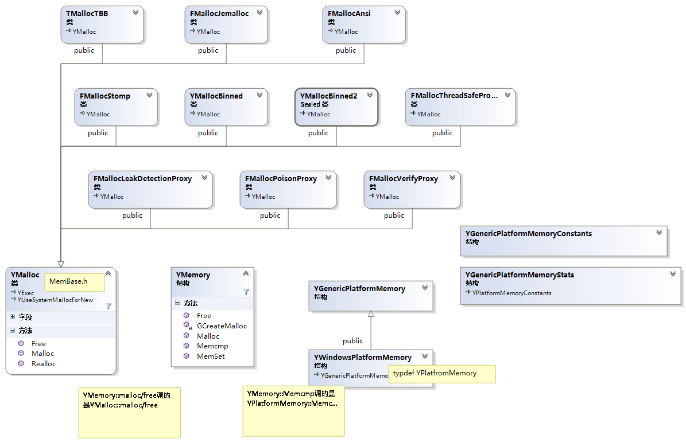

# UE Runtime Core 结构设计

## 类图如下：

## PlatformMemory
1.	PlatformMemory为主要头文件，其中包含GenericPlatformMemory和WindowsPlatformMemory(WIN平台）。
2.	GenericPlatformMemory实现基础功能
3.	WindowPlatformMemory实现平台特化，最终通过typedef为UPlatformMemory.

### 统计信息
1.	FGenericPlatformMemoryConstants  
    1.TotalPhysical  
	2.TotalVirtual  
	3.PageSize  
 	4.etc.
2.  FGenericPlatformMemoryStats : 继承于FGenericPlatformMemoryConstants  
    1.	AvailablePhysical  
    2.	AvailableVirtual  
    3.	UsedPhysical  
    4.	etc.
3.  FPlatformMemoryStats : FGenericPlatformMemoryStats  
	添加平台相关的数据
4.  FGenericMemoryStats
    里面有个map,保存各种内存数据，对外接口
>也就是说MemoryConstants是用来统计固件内存的，MemoryStats又添加了当前实时的内存状态

## FGnericPlatformMemory
3.	FGenericPlatformMemory   
    该类只有static函数，
	1.	统计内存使用，返回上述内存统计信息： GetStats();
	2.	内存分配初始化策略 `init()`
		1.	`SetupMemoryPools`: 设置内存池
		2.	`OnOutOfMemory`:　　预分配32mb的内存防止在OO(out of memory)crash的时候，没有空间打log;
	3.	SharedMemor
	4.	内存操作　　
		1.	`BinnedAllocFromOS` :使用VirtualAlloc系统调用
		2.	`BinnedFreeToOS`
		3.	`GPUMalloc` ：UMA架构有效
		4.	`Memmove/cmp/cpy/zero/set` `BigBlockMemoryCpy`
		5.	`StreamingMemcpy`
	5.	Dump
4.	FWindowsPlatformMemory :继承于FGenericPlatformMemory
	在Windows平台下typedef为FPlatformMemory

## MemoryBase
### FMalloc  （MemoryBase.h）
   1.	提供空间分配的基类，实现有MallocAnsic,MallocBinned,MallocBinned2,MallocStomp,MallocTBB等。
   2.	全局空间分配器GMalloc
   3.	FMalloc 主要有
  		1.	Malloc, Realloc,Free,QuantizeSize, Trim    
  		6.	SetupTLSCachesOnCurrentThread  	  
  		7.	ClearTLSCachesOnCurrentThread  
  		8.	mallc/realloc/free的记数器  
  **GAlloc**是一种分配器（全局），在程序初始化时设定，可以在develop下通过命令行更改，可配置，在进入Main函数之前就被调用，在第一次调用时设置
### FMemory （UnrealMemory.h)
   1.   使用代理的方式，将GMalloc根据配置设为指定的Malloc,`YMemory::GCreateMalloc()`;   
   2.   使用代理的方式，对外有MemCmp/copy/move等函数；
   3.   SystemMallc/Free等函数；

