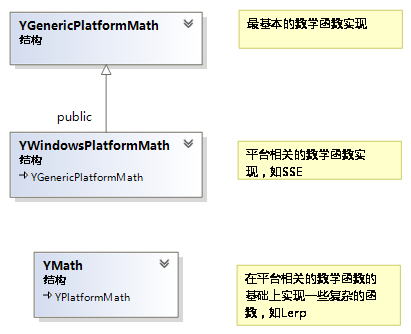

# UE Runtime Core 结构设计

## 数学库
UE的数学库为了保证跨平台和性能，分为PlatformMath和VectorMath两个部分
### 数学库的工作文件组织方式
在Engine/runtime/core/中：

1.	Private/CorePrivatePCH.h 与Core.h 基本上是一样的，前者用来做PCH。在这个文件中，数学库的包含关系如下

		#include "UnrealMathUtility.h"	// FMat.
		#include "UnrealMath.h"			// Vector math functions.
	通过注释可以看出:
	1.	`UnrealMathUitlity.h`主要负责FMat类的相关数学函数；
	2.	`unreal Math.h`主要负责VectorMath相关的代码。

2. UnrealMathUtility.h 
	1.	首先包含`HAL/Platform.h`。`Platform.h`主要包含像是uint8等跨平台的基本类型的定义，已经一些编译warning的忽略。
	2.	其次包含`HAL/PlatformMath.h`。根据PLATFORM_WINDOWS的宏定义来选择包含`Windows/WindowsPlatformMath.h`。
	3.	Windows/WindowsPlatformMath.h
	    1.	包含`GenericPlatform/GenericPlatformMath.h`,相当于整个数学库的基类，定义了FGenericPlatformMath的类，FWindowsPlatformMath类继承于FGenericPlatformMath类，不过用的是函数覆盖，或者说是特化。
	    2.	包含`WindowsSystemIncludes`,包含了整个Windows的最小头文件实现。使用`WindowsHWrapper.h`这个头文件，通过`#pragma push/pop _macro()`来实现最小化的引用Windows.h文件，又不引用多于的宏，如`TEXT`宏等；并且undef了不少window使用的类型，如uin8,int32，float等。
		3.	之后是SSE特化后的函数的实现
		4.	最后``typedef FWindowsPlatformMath FPlatformMath``
		5.	**注意**：之所以这样子设计，很大情况下在于float to int在某些编译器下比较慢，比如x86下，设编译器不使用SSE，就默认用FPU实现，比较慢。
	4.	定义FMath继承于FPlatformMath,在特化指令的基础上实现Rand,Round,Truc,Lerp，Sect等函数。  
		UnrealMathUtility里的继承链如下 
		

2.	UnrealMath
	1.	包含向量的相关实现
	2.	包含`VectorRegister.h`
		1.	根据不同的平台选择开启SSE指令，xbox使用`DirectXMath.h`,Windows用`UnrealMathSSE.h`，Arm使用NeoN的SSE,默认使用FPU，只在托管c++时使用；
		2.	UnrealMathSSE,使用手写的SSE指令
